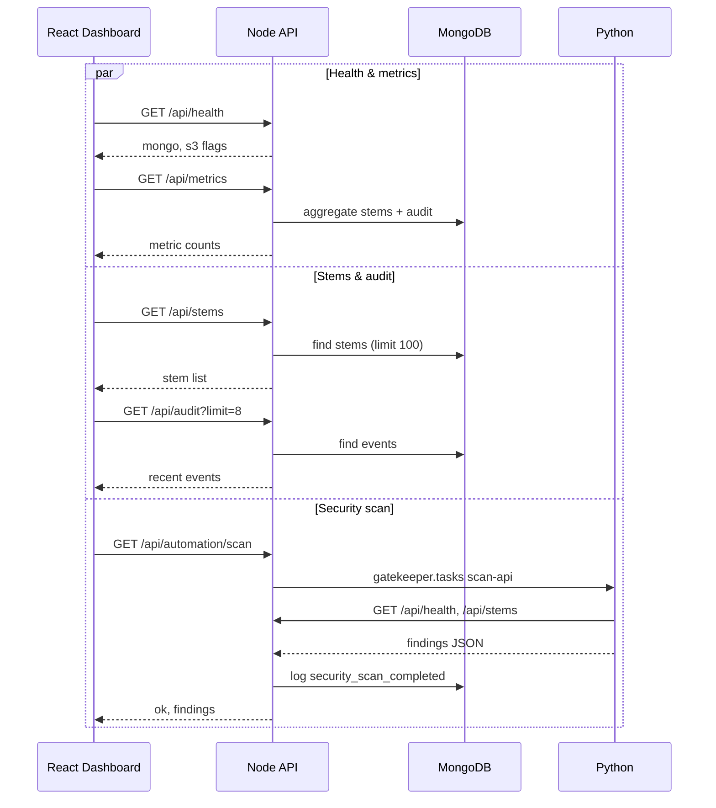
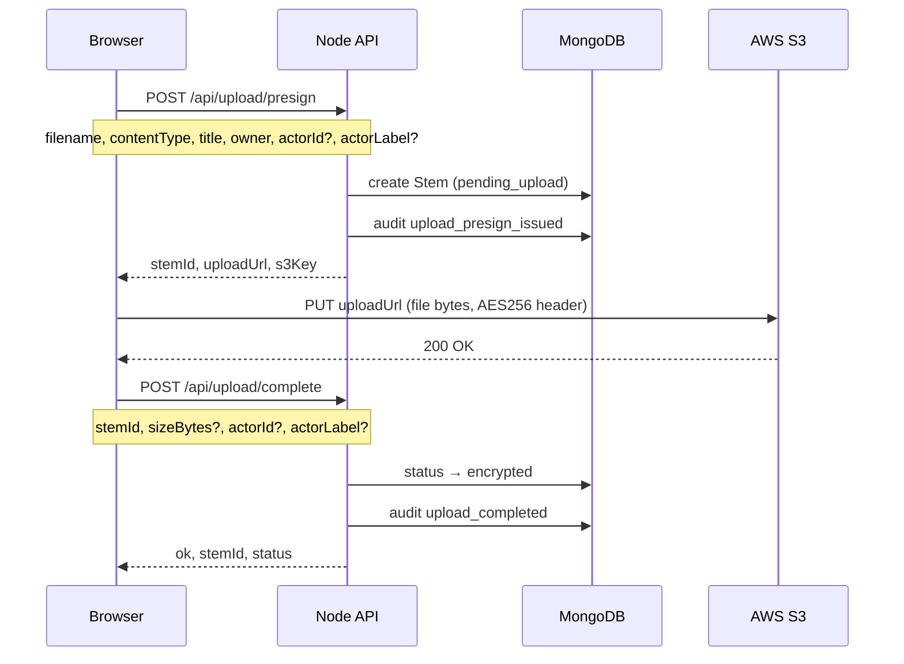
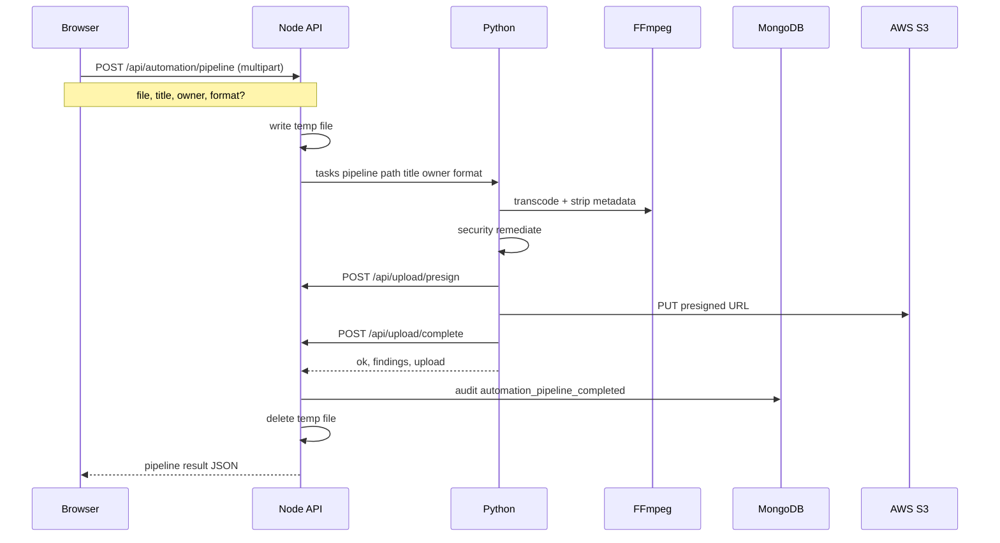
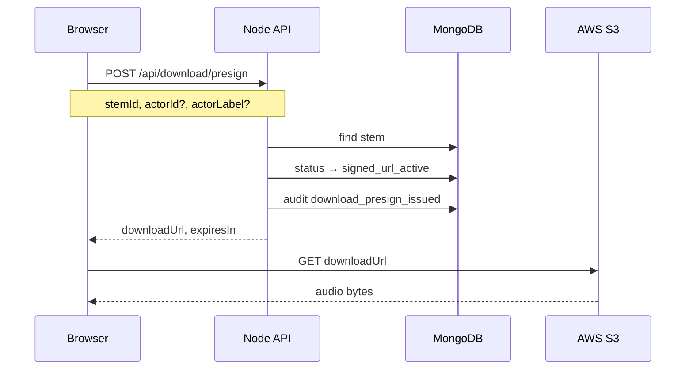
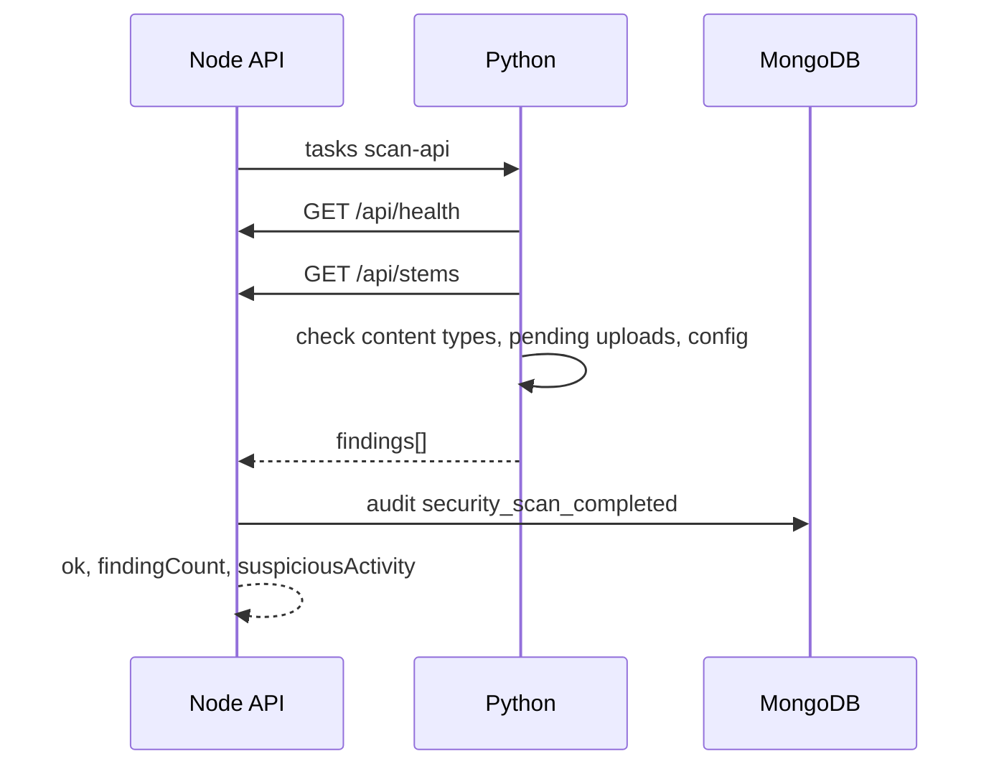
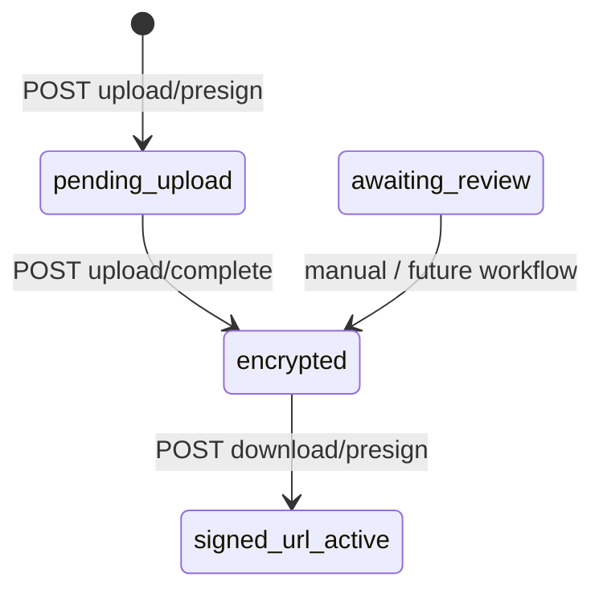

# Backend API — Workflows & Reference

Base URL (local): `http://127.0.0.1:3000`  
All routes support `OPTIONS` for CORS preflight. JSON responses include CORS headers when `GATEKEEPER_CORS_ORIGIN` is set (or `*` in development).

**Source:** `backend/src/app/api/**/route.ts`

---

## Endpoint index

| Method | Path | Auth | Mongo required | S3 required |
|--------|------|------|----------------|-------------|
| `GET` | `/api/health` | No | No | No |
| `GET` | `/api/metrics` | No | Optional¹ | No |
| `GET` | `/api/stems` | No | Yes | No |
| `GET` | `/api/audit` | No | Yes | No |
| `POST` | `/api/upload/presign` | No | Yes | Yes² |
| `POST` | `/api/upload/complete` | No | Yes | No |
| `POST` | `/api/download/presign` | No | Yes | Yes² |
| `GET` | `/api/automation/scan` | No | Optional³ | No |
| `POST` | `/api/automation/pipeline` | No | Via Python | Via Python |

¹ Returns zeroed metrics when Mongo is unset.  
² Or `GATEKEEPER_MOCK_CLOUD=true` (no real URLs).  
³ Scan logs to audit only if Mongo is configured.

---

## Workflow 1 — Dashboard load

Called in parallel when the React app mounts (`src/App.jsx` → `src/lib/gatekeeperApi.js`).



---

## Workflow 2 — Direct stem upload (browser → S3)

Used when the upload modal has **Python pipeline** unchecked.



### `POST /api/upload/presign`

**Request body**

```json
{
  "filename": "lead-vox.wav",
  "contentType": "audio/wav",
  "title": "SZA Vox Lead v4",
  "owner": "A&R Team",
  "actorId": "dashboard",
  "actorLabel": "Gatekeeper Dashboard"
}
```

**Success `200`**

```json
{
  "stemId": "STEM-A1B2C3",
  "s3Key": "stems/STEM-A1B2C3/lead-vox.wav",
  "expiresIn": 600,
  "uploadUrl": "https://s3.amazonaws.com/...",
  "serverSideEncryption": "AES256",
  "mockCloud": false
}
```

**Mock mode `200`** (`GATEKEEPER_MOCK_CLOUD=true`): `uploadUrl` is `null`, `mockCloud: true`.

**Errors:** `400` validation, `503` Mongo/S3 not configured.

---

### `POST /api/upload/complete`

**Request body**

```json
{
  "stemId": "STEM-A1B2C3",
  "sizeBytes": 1048576,
  "actorId": "dashboard",
  "actorLabel": "Gatekeeper Dashboard"
}
```

**Success `200`**

```json
{
  "ok": true,
  "stemId": "STEM-A1B2C3",
  "status": "encrypted"
}
```

**Errors:** `404` stem not found, `503` Mongo not configured.

---

## Workflow 3 — Python pipeline upload (default in UI)

Transcode → security remediate → presign → S3 PUT → complete.



### `POST /api/automation/pipeline`

**Request:** `multipart/form-data`

| Field | Required | Values |
|-------|----------|--------|
| `file` | Yes | Audio file |
| `title` | Yes | Stem title |
| `owner` | Yes | Owner label |
| `format` | No | `flac` (default), `wav`, `mp3`, `aac` |

**Success `200`** (shape from Python `remediate_and_upload`)

```json
{
  "ok": true,
  "findings": [],
  "upload": {
    "stemId": "STEM-…",
    "uploadedToS3": true,
    "mockCloud": false
  },
  "uploadedPath": "/tmp/…/stem.flac",
  "contentType": "audio/flac"
}
```

**Errors:** `400` missing fields, `503` Python/ffmpeg failure.

**Node implementation:** `backend/src/lib/automation.ts` spawns `python -m gatekeeper.tasks`.

---

## Workflow 4 — Download / stem access

Records **who** accessed **which stem** in the audit trail.



### `POST /api/download/presign`

**Request body**

```json
{
  "stemId": "STEM-A1B2C3",
  "actorId": "dashboard",
  "actorLabel": "Gatekeeper Dashboard"
}
```

**Success `200`**

```json
{
  "stemId": "STEM-A1B2C3",
  "expiresIn": 600,
  "downloadUrl": "https://s3.amazonaws.com/...",
  "mockCloud": false
}
```

**Audit record**

| Field | Example |
|-------|---------|
| `action` | `download_presign_issued` |
| `resourceType` | `download` |
| `resourceId` | `STEM-A1B2C3` |
| `actorLabel` | Who requested access |
| `detail.s3Key` | Object key in bucket |

---

## Workflow 5 — Security scan

Runs on dashboard load and can be called independently.



### `GET /api/automation/scan`

**Success `200`**

```json
{
  "ok": true,
  "findingCount": 0,
  "findings": [],
  "suspiciousActivity": false
}
```

**Finding object**

```json
{
  "code": "stem_content_type_risk",
  "message": "Stem STEM-… has non-allowlisted content type …",
  "severity": "medium",
  "remediated": false,
  "resourceId": "STEM-…",
  "detail": {}
}
```

**Errors `503`:** Python not installed, Mongo unreachable from Python, etc.

---

## Read-only endpoints

### `GET /api/health`

```json
{
  "ok": true,
  "service": "gatekeeper-api",
  "mongo": true,
  "s3": true
}
```

### `GET /api/metrics`

```json
{
  "activeSessions": 14,
  "encryptedStems": 387,
  "pendingReviews": 9,
  "auditEvents24h": 128,
  "highPrioritySessions": 5,
  "awaitingProducer": 3,
  "suspiciousActivity": false,
  "mock": false
}
```

### `GET /api/stems`

```json
{
  "stems": [
    {
      "id": "STEM-A1B2C3",
      "title": "SZA Vox Lead v4",
      "owner": "A&R Team",
      "status": "Encrypted",
      "contentType": "audio/wav",
      "version": 1,
      "updatedAt": "2026-05-19T10:21:00.000Z"
    }
  ]
}
```

### `GET /api/audit?limit=50`

`limit` — integer 1–200 (default 50).

```json
{
  "events": [
    {
      "id": "…",
      "action": "upload_completed",
      "resourceType": "upload",
      "resourceId": "STEM-A1B2C3",
      "actorId": "dashboard",
      "actorLabel": "Gatekeeper Dashboard",
      "detail": { "sizeBytes": 1048576 },
      "createdAt": "2026-05-19T10:21:00.000Z"
    }
  ]
}
```

---

## Stem status lifecycle



| DB status | UI label |
|-----------|----------|
| `pending_upload` | Pending Upload |
| `encrypted` | Encrypted |
| `awaiting_review` | Awaiting Review |
| `signed_url_active` | Signed URL Active |

---

## Environment variables (backend)

See `backend/.env.example`.

| Variable | Affects |
|----------|---------|
| `MONGODB_URI` | Stems, audit, metrics |
| `AWS_*`, `S3_BUCKET` | Presigned PUT/GET |
| `GATEKEEPER_MOCK_CLOUD` | Skip real S3 URLs |
| `GATEKEEPER_SIGNED_URL_SECONDS` | Presign TTL (60–3600, default 600) |
| `GATEKEEPER_CORS_ORIGIN` | Browser cross-origin |
| `GATEKEEPER_PYTHON` | Path to Python for automation routes |
| `GATEKEEPER_BASE_URL` | URL Python client uses to call back |

---

## Frontend mapping

| Dashboard action | API call |
|------------------|----------|
| Page load | `health`, `metrics`, `stems`, `audit`, `automation/scan` |
| Upload (pipeline on) | `POST /api/automation/pipeline` |
| Upload (pipeline off) | `presign` → S3 PUT → `complete` |
| Get URL | `POST /api/download/presign` |
| View Full Audit Trail | `GET /api/audit?limit=200` |

Client: `src/lib/gatekeeperApi.js`  
Dev proxy: `vite.config.js` → `/api` → `:3000`
